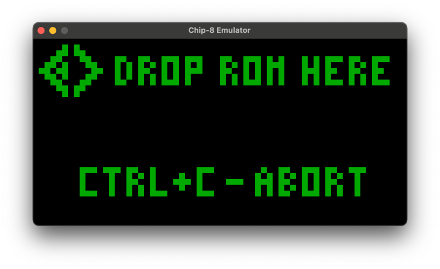
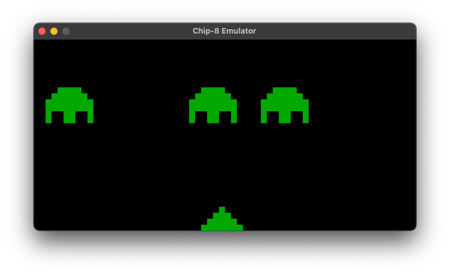
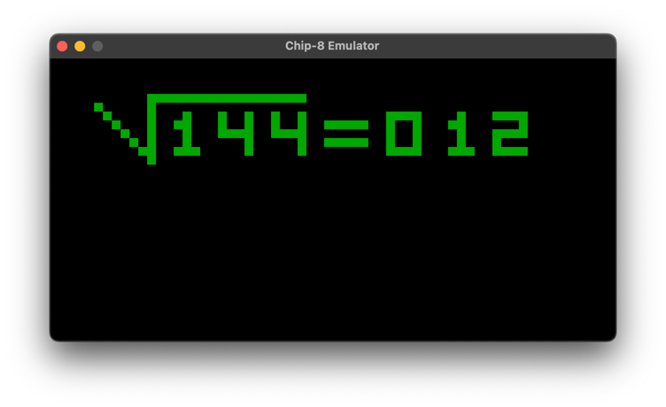
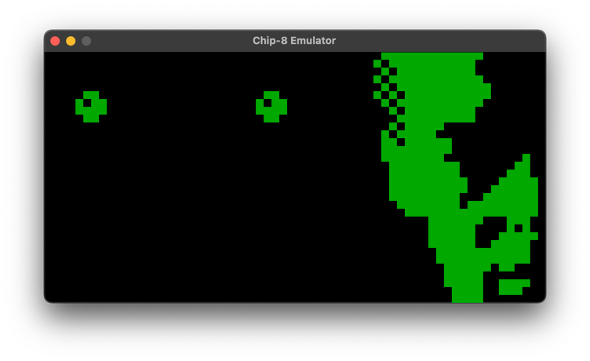

# Chip-8 Emulator in F# and MonoGame

This project is a fully accurate Chip-8 emulator written in F# and MonoGame. It supports all instructions and sound, providing an authentic Chip-8 experience.

## How to Use

Using the emulator is straightforward:

1. Start the emulator. The intro ROM will automatically load.
2. To load a different ROM, simply drag and drop the ROM file onto the emulator's window.
3. If you want to return to the intro ROM, press `Ctrl + C`. You can then load a different ROM if you wish.

## Examples

## References and Useful Articles

For more information about Chip-8 and emulator development, check out the following resources:

- [Chip-8 Technical Reference](http://devernay.free.fr/hacks/chip8/C8TECH10.HTM#0.0)
- [Chip-8 Test Suite on GitHub](https://github.com/Timendus/chip8-test-suite)
- [Guide to making a CHIP-8 emulator](https://tobiasvl.github.io/blog/write-a-chip-8-emulator/#logical-and-arithmetic-instructions)
